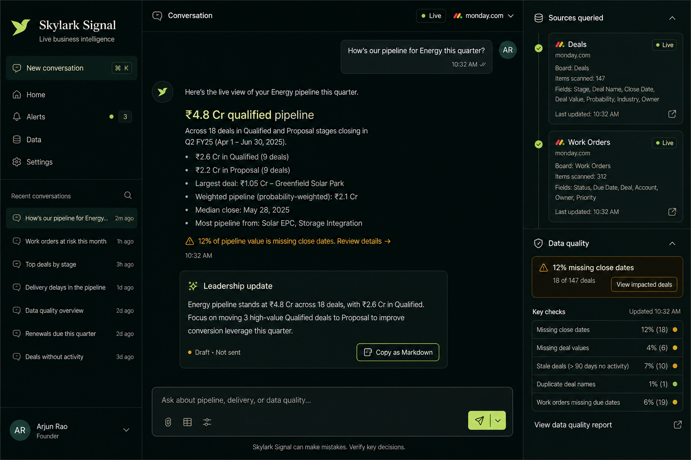
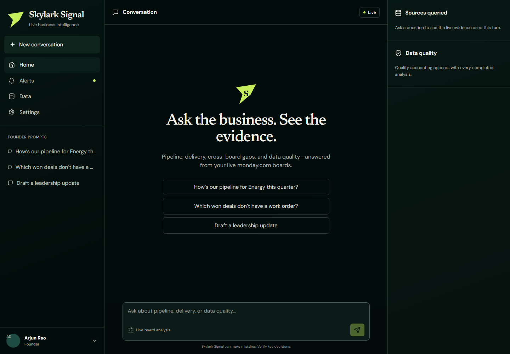
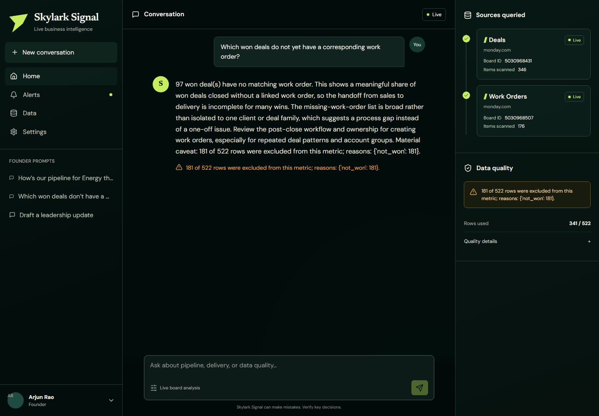
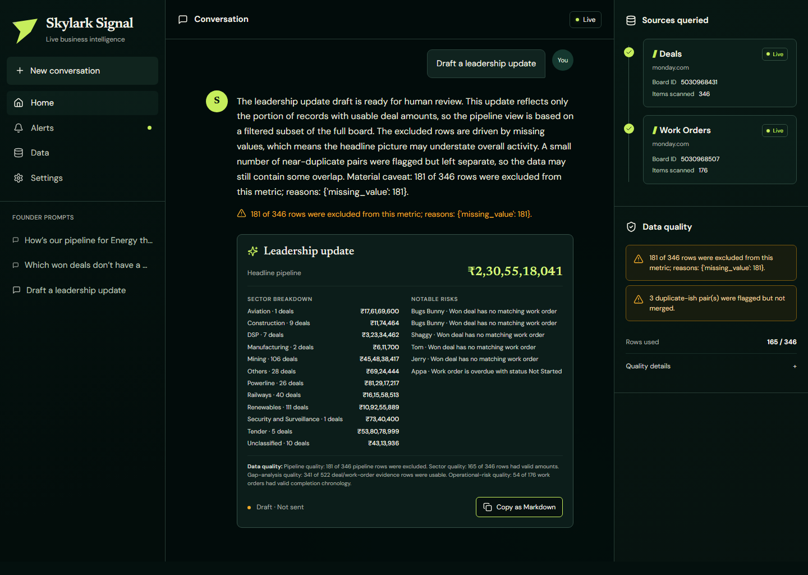
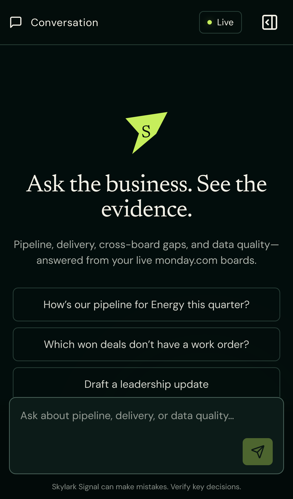
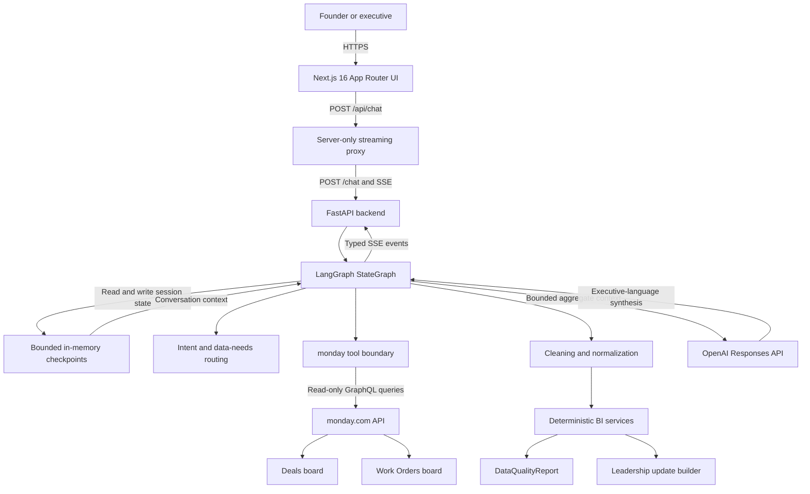
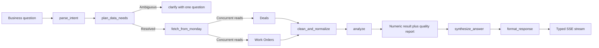

<!-- markdownlint-disable MD013 MD033 MD041 MD060 -->

<div align="center">

<h1 id="skylark-signal">Skylark Signal</h1>

<p><strong>Ask the business. See the evidence.</strong></p>

<p>
  <a href="https://github.com/9059Rohith/skylark/actions/workflows/ci.yml"></a>
  
  <a href="https://github.com/9059Rohith/skylark/stargazers"></a>
  <a href="https://github.com/9059Rohith/skylark/commits/main"></a>
</p>

<p>
  
  
  
  
  
  
</p>



</div>

## Table of Contents

- [Overview](#overview)
- [Demo / Screenshots](#demo--screenshots)
- [Architecture](#architecture)
- [Key Features](#key-features)
- [Tech Stack](#tech-stack)
- [Getting Started](#getting-started)
- [Usage](#usage)
- [Project Structure](#project-structure)
- [API Reference](#api-reference)
- [Testing](#testing)
- [Roadmap](#roadmap)
- [Contributing](#contributing)
- [Team / Authors](#team--authors)
- [Acknowledgements](#acknowledgements)
- [License](#license)

## Overview

Skylark Signal lets founders ask plain-English questions about sales and project delivery and receive answers backed by live monday.com data. It reads separate Deals and Work Orders boards, repairs inconsistent dates, amounts, names, stages, and sectors, then performs business calculations in deterministic code. Every answer identifies the boards queried, the records used, and the data-quality limitations that could affect the conclusion. The result is a conversational BI workspace for pipeline reviews, delivery analysis, sales-to-operations handoffs, and human-reviewed leadership updates.

## Demo / Screenshots

<div align="center">

<h3>Product walkthrough</h3>

<video src="assets/demo.mp4" controls width="100%"></video>

<p>
  <a href="https://drive.google.com/file/d/1E8SA5xP8uwA5afZlIonnkNX6DXlBPFro/view?usp=sharing">▶ Watch the 2:55 narrated demo on Google Drive</a>
  · <a href="assets/demo.mp4">Download the repository copy</a>
</p>

<br>

<a href="https://skylark-signal-lac.vercel.app"></a>

</div>

<table>
  <tr>
    <td width="50%" align="center">
      
      <br><sub><strong>Conversation workspace:</strong> founder prompts, live status, and evidence sidebar.</sub>
    </td>
    <td width="50%" align="center">
      
      <br><sub><strong>Cross-board analysis:</strong> Deals and Work Orders queried with visible row accounting.</sub>
    </td>
  </tr>
  <tr>
    <td width="50%" align="center">
      
      <br><sub><strong>Leadership draft:</strong> pipeline headline, sector breakdown, risks, and copyable Markdown.</sub>
    </td>
    <td width="50%" align="center">
      
      <br><sub><strong>Responsive experience:</strong> the complete evidence workflow on a mobile viewport.</sub>
    </td>
  </tr>
</table>

## Architecture



The browser communicates only with the Next.js server route, so monday.com and model credentials never enter client-side JavaScript. FastAPI owns validation and typed Server-Sent Events; LangGraph coordinates routing, retrieval, cleaning, deterministic analysis, clarification, and response synthesis. The application has no persistent database: bounded in-memory checkpoints retain short-lived conversation context, while monday.com remains the live source of truth. OpenAI is the default synthesis provider, with an environment-selected Anthropic adapter available without changing the graph.



The data pipeline preserves original values for traceability, normalizes only through documented rules, and never drops an entire record because one field is missing. Metrics use the valid subset required for each calculation and return their own quality report before any model-written explanation is produced.

## Key Features

- **Live, read-only monday.com access** 🔒 — retrieves current board data through query-only GraphQL with no mutations or write tools.
- **Resilient messy-data normalization** 🧹 — handles multiple date formats, INR/USD notation, Indian lakh/crore suffixes, fuzzy sectors, blanks, and inconsistent casing.
- **Deterministic business metrics** 📐 — keeps filtering, joins, arithmetic, denominators, and exclusions out of the language model.
- **Cross-board sales-to-delivery analysis** 🔗 — identifies won deals without matching work orders using explicit relations, normalized deal names, and client-code fallbacks.
- **Visible data-quality accounting** 🛡️ — returns source counts, missing fields, excluded rows, normalization decisions, duplicate-like pairs, and partial-fetch warnings.
- **Conversational follow-ups** 💬 — preserves bounded UUIDv4 session context for questions such as “break that down by sector.”
- **Progressive streaming responses** ⚡ — streams real graph stages, sources, caveats, leadership objects, and tokens through typed SSE events.
- **Leadership update drafts** 📋 — creates a structured, copyable draft while keeping a human in control of external sharing.
- **Graceful upstream failure handling** 🧯 — sanitizes authentication, rate-limit, timeout, pagination, schema, model, and partial-data failures.
- **Deployment and release discipline** 🚀 — includes Docker images, Docker Compose, Render configuration, Vercel compatibility, CI, security guidance, and release evidence.

## Tech Stack

| Layer | Technology | Purpose |
|---|---|---|
| Frontend | Next.js 16, React 19, TypeScript 5.7, Tailwind CSS 3.4 | Responsive chat, streaming event handling, sources panel, caveats, and leadership cards |
| Frontend gateway | Next.js App Router route handler | Server-only `/api/chat` proxy with progressive SSE forwarding and a 120-second timeout |
| Backend | Python 3.11, FastAPI 0.141, Pydantic 2.12 | Typed HTTP contracts, validation, lifecycle management, CORS, health checks, and SSE |
| Agent orchestration | LangGraph 1.2 | Inspectable multi-node workflow, clarification routing, and session checkpoints |
| Business intelligence | Typed Python services | Deterministic pipeline, operations, data-quality, cross-board, and leadership calculations |
| AI / ML | OpenAI Responses API; optional Anthropic adapter | Intent assistance and bounded executive-language synthesis, never financial arithmetic |
| External data | monday.com GraphQL API `2026-07` | Live, read-only Deals and Work Orders retrieval with cursor pagination and schema discovery |
| State / database | Bounded in-memory LangGraph checkpointer; no persistent database | Short-lived conversational continuity for the single-worker prototype |
| DevOps / infrastructure | Docker, Docker Compose, GitHub Actions, Render, Vercel | Reproducible builds, CI gates, container deployment, and hosted evaluation |
| Testing | Pytest, pytest-asyncio, Vitest, Testing Library, Playwright, Ruff, ESLint, TypeScript | Unit, integration, routing, streaming, UI, static-analysis, and release verification |

## Getting Started

### Prerequisites

- Python **3.11.x**
- Node.js **22.x** and npm **10.x**
- Docker Engine **24+** with Docker Compose **v2.24+** for the container workflow
- A monday.com account that can read the imported Deals and Work Orders boards
- A read-only monday.com API token
- An OpenAI API key, or an Anthropic API key when selecting that provider

### Installation

1. Clone the repository.

   ```bash
   git clone https://github.com/9059Rohith/skylark.git skylark-bi-agent
   cd skylark-bi-agent
   ```

2. Create the Python environment and install backend dependencies.

   ```bash
   python -m venv .venv
   source .venv/bin/activate
   python -m pip install --upgrade pip
   python -m pip install -r backend/requirements.txt
   ```

   On Windows PowerShell, activate the environment with:

   ```powershell
   .\.venv\Scripts\Activate.ps1
   ```

3. Install the locked frontend dependencies.

   ```bash
   cd frontend
   npm ci
   cd ..
   ```

4. Create local environment files.

   ```bash
   cp backend/.env.example backend/.env
   cp frontend/.env.example frontend/.env.local
   ```

   On Windows PowerShell:

   ```powershell
   Copy-Item backend\.env.example backend\.env
   Copy-Item frontend\.env.example frontend\.env.local
   ```

5. Import the provided spreadsheets into separate monday.com boards by following [data-setup/import_instructions.md](data-setup/import_instructions.md), then place the resulting board IDs and server-side credentials in `backend/.env`.

### Environment Variables

| Variable | Required | Default | Description |
|---|:---:|---|---|
| `MONDAY_API_TOKEN` | Yes | — | Server-only token belonging to a user/app with read access to both boards |
| `MONDAY_DEALS_BOARD_ID` | Yes | — | Numeric ID of the imported Deals board |
| `MONDAY_WORK_ORDERS_BOARD_ID` | Yes | — | Numeric ID of the imported Work Orders board |
| `LLM_PROVIDER` | No | `openai` | Runtime synthesis adapter: `openai` or `anthropic` |
| `OPENAI_API_KEY` | Conditional | — | Required when `LLM_PROVIDER=openai` |
| `OPENAI_MODEL` | No | `gpt-5.4-mini` | OpenAI Responses API model |
| `OPENAI_TIMEOUT_SECONDS` | No | `20` | Per-attempt OpenAI timeout, bounded to 120 seconds |
| `OPENAI_MAX_RETRIES` | No | `2` | OpenAI retry count, bounded to five |
| `OPENAI_MAX_TOKENS` | No | `700` | Maximum synthesized response tokens |
| `ANTHROPIC_API_KEY` | Conditional | — | Required when `LLM_PROVIDER=anthropic` |
| `ANTHROPIC_MODEL` | No | `claude-sonnet-5` | Anthropic model selected by the optional adapter |
| `ANTHROPIC_TIMEOUT_SECONDS` | No | `20` | Per-attempt Anthropic timeout |
| `ANTHROPIC_MAX_RETRIES` | No | `2` | Anthropic retry count |
| `ANTHROPIC_MAX_TOKENS` | No | `700` | Maximum Anthropic response tokens |
| `LLM_CONTEXT_MAX_CHARS` | No | `1200` | Upper bound for aggregate facts sent to the synthesis model |
| `DETERMINISTIC_SYNTHESIS_FALLBACK` | No | `false` | Local/test fallback; keep disabled in production |
| `USD_TO_INR_RATE` | Conditional | — | Explicit conversion rate used only when USD amounts are present |
| `FISCAL_YEAR_START_MONTH` | No | `1` | Fiscal year start month, from `1` through `12` |
| `APP_TIMEZONE` | No | `Asia/Kolkata` | Timezone for relative periods such as “this month” |
| `CORS_ALLOW_ORIGINS` | No | `http://localhost:3000` | Comma-separated frontend origin allow-list |
| `MAX_MESSAGE_LENGTH` | No | `4000` | Maximum accepted chat message length |
| `CHECKPOINT_MAX_SESSIONS` | No | `1000` | Maximum bounded in-memory conversation sessions |
| `CHECKPOINT_SESSION_TTL_SECONDS` | No | `3600` | Inactive session lifetime in seconds |
| `BACKEND_URL` | Frontend | `http://localhost:8000` | Server-only FastAPI origin used by the Next.js proxy |
| `PORT` | Hosting | `8000` / `3000` | Backend or frontend container listen port |

Never expose server credentials through variables prefixed with `NEXT_PUBLIC_`. See [SECURITY.md](SECURITY.md) for credential, logging, CORS, and deployment guidance.

### Running Locally

Start the backend from the repository root:

```bash
uvicorn app.main:app --app-dir backend --reload --port 8000
```

Start the frontend in a second terminal:

```bash
cd frontend
npm run dev
```

- Application: `http://localhost:3000`
- Backend API: `http://localhost:8000`
- Swagger UI: `http://localhost:8000/docs`
- Readiness probe: `http://localhost:8000/health`

### Running with Docker

Start both services from a fresh checkout:

```bash
docker compose up --build
```

Stop the stack with:

```bash
docker compose down
```

### Deployment

The hosted reference deployment uses [Vercel](https://vercel.com) for both public projects; `render.yaml` remains the preferred Docker backend blueprint.

1. Create a Render Blueprint from `render.yaml` and add the three monday.com variables plus the selected model credential.
2. Wait until `https://<backend-host>/health` returns HTTP `200` with `{"status":"ready","missing":[]}`.
3. Import `frontend/` into Vercel and set server-only `BACKEND_URL=https://<backend-host>`.
4. Set backend `CORS_ALLOW_ORIGINS` to the exact Vercel frontend origin and redeploy.
5. Exercise all five evaluator prompts and confirm that the Sources panel reports live board IDs and plausible row counts.

Current hosted services:

- Frontend: [https://skylark-signal-lac.vercel.app](https://skylark-signal-lac.vercel.app)
- Backend: [https://skylark-signal-api.vercel.app](https://skylark-signal-api.vercel.app)
- Health: [https://skylark-signal-api.vercel.app/health](https://skylark-signal-api.vercel.app/health)

## Usage

Check readiness:

```bash
curl --fail http://localhost:8000/health
```

Submit a chat request and consume the SSE stream:

```bash
curl --no-buffer \
  --request POST \
  --header "Content-Type: application/json" \
  --header "Accept: text/event-stream" \
  --data '{"message":"Which won deals do not yet have a corresponding work order?","session_id":"550e8400-e29b-41d4-a716-446655440000"}' \
  http://localhost:8000/chat
```

Useful founder-level prompts:

- `How is our pipeline looking for Energy this quarter?`
- `Which won deals do not yet have a corresponding work order?`
- `What is our average work order completion time this month?`
- `How much of our deals data is missing close dates?`
- `Draft a leadership update.`
- `Break that down by sector.`

See the interactive [Swagger UI](http://localhost:8000/docs), the [board schema](data-setup/board_schema.md), and the [release verification checklist](docs/verification/RELEASE_CHECKLIST.md) for fuller operational detail.

## Project Structure

```text
skylark-bi-agent/
├── .github/            # GitHub Actions CI workflows and repository automation
├── assets/             # README poster, screenshots, and narrated product demo
├── backend/            # FastAPI, LangGraph, monday adapter, BI services, and Pytest suite
│   ├── app/            # Production Python package
│   └── tests/          # Unit, integration, contract, and release-archetype tests
├── data-setup/         # One-time monday.com import guide and target board schema
├── docs/               # Design records, implementation plan, and release evidence
├── frontend/           # Next.js application, streaming proxy, UI components, and Vitest suite
│   ├── app/            # App Router pages, styles, and API proxy
│   └── components/     # Chat, source, message, and leadership-update components
├── DECISION_LOG.md     # Assumptions, trade-offs, and scoped product decisions
├── docker-compose.yml  # Local full-stack orchestration
├── render.yaml         # Render backend Blueprint
├── SECURITY.md         # Security model and responsible disclosure guidance
└── README.md           # Project overview, setup, operation, and contribution guide
```

## API Reference

| Method | Endpoint | Description | Auth required |
|---|---|---|:---:|
| `GET` | `/health` | Sanitized readiness result and names of missing configuration keys | No |
| `POST` | `/chat` | Validates a UUIDv4 session and message, then returns typed `text/event-stream` events | No end-user auth¹ |
| `POST` | `/api/chat` | Next.js server proxy that forwards the upstream SSE body without exposing `BACKEND_URL` | No |
| `GET` | `/docs` | FastAPI Swagger UI | No |
| `GET` | `/openapi.json` | Machine-readable OpenAPI document | No |

¹ The prototype does not bundle user authentication. The backend itself must be configured with server-side monday.com and model credentials; protect the deployment before exposing private business data beyond an evaluation environment.

<details>
<summary><strong>POST /chat request and event contract</strong></summary>

Request body:

```json
{
  "message": "How is our pipeline looking this quarter?",
  "session_id": "550e8400-e29b-41d4-a716-446655440000"
}
```

The stream can emit these named events:

| Event | Purpose |
|---|---|
| `status` | Real graph-stage progress such as routing, fetching, cleaning, or analysis |
| `sources` | Board IDs, names, item counts, partial flags, and sanitized source errors |
| `caveats` | Human-readable caveats plus the structured `DataQualityReport` |
| `leadership_update` | Typed leadership draft, quality breakdown, risks, and Markdown |
| `token` | Incremental answer text |
| `done` | Final session ID and resolved intent |
| `error` | Sanitized configuration, upstream, validation, or internal failure |

</details>

## Testing

Run the complete backend verification suite:

```bash
python -m pytest backend/tests -q
python -m ruff check backend
python -m compileall -q backend/app backend/tests
```

Run the frontend tests and build gates:

```bash
cd frontend
npm test
npm run lint
npm run typecheck
npm run build
npm audit --audit-level=high
```

Generate backend coverage locally:

```bash
python -m pip install coverage
coverage run --source=backend/app -m pytest backend/tests
coverage report --show-missing
coverage html
```

The testing strategy concentrates on the highest-risk boundaries: messy-data normalization, exclusion accounting, deterministic metrics, graph routing and clarification, monday pagination/retries, session bounds, SSE contracts, frontend stream reduction, and release archetypes. CI also validates Docker Compose and builds both production images.

## Roadmap

- [x] Live read-only monday.com GraphQL integration
- [x] Multi-node LangGraph workflow with targeted clarification
- [x] Deterministic pipeline, operational, quality, and cross-board metrics
- [x] OpenAI default provider with optional Anthropic adapter
- [x] Typed SSE streaming and evidence-first responsive interface
- [x] Structured leadership-update draft with Markdown copy support
- [x] Docker, Render, Vercel, CI, security, and deployment documentation
- [ ] Add application authentication and per-user authorization
- [ ] Replace in-memory checkpoints with a shared Postgres-backed store
- [ ] Add monday OAuth and tenant-aware board configuration
- [ ] Add redacted observability, latency metrics, and schema-drift alerts
- [ ] Expand entity resolution with reviewer-confirmed matching candidates

## Contributing

Contributions should preserve read-only data access, deterministic arithmetic, explicit quality accounting, and server-only secrets.

1. Fork the repository and create a focused branch: `git switch -c feat/short-description`.
2. Add or update tests, then run the backend, frontend, and build commands above.
3. Open a pull request describing the business behavior, evidence, trade-offs, and any schema assumptions.

Python follows Ruff-enforced style; TypeScript must pass ESLint and strict type checking. Use Conventional Commit prefixes such as `feat:`, `fix:`, `test:`, `docs:`, and `chore:`.

## Team / Authors

| Name | Role | GitHub | LinkedIn |
|---|---|---|---|
| Rohith | Full-stack and AI engineer | [@9059Rohith](https://github.com/9059Rohith) | `<TODO: fill in>` |

## Acknowledgements

- [Skylark Drones](https://www.skylarkdrones.com/) for the assignment context and supplied spreadsheet datasets.
- [monday.com GraphQL API](https://developer.monday.com/api-reference/docs) for the live operational-data boundary.
- [LangGraph](https://langchain-ai.github.io/langgraph/), [FastAPI](https://fastapi.tiangolo.com/), and [Next.js](https://nextjs.org/) for the orchestration and application foundations.
- [OpenAI](https://platform.openai.com/docs/) for the production-default Responses API and Anthropic for the optional provider adapter.
- [RapidFuzz](https://rapidfuzz.github.io/RapidFuzz/) for conservative sector-label matching.
- OpenAI Codex/GPT-5-family tooling assisted architecture, implementation, testing, and documentation; Rohith supplied the requirements and retained responsibility for credential scope, data validation, deployment, and publication.

The spreadsheet files are used only for a one-time manual import into monday.com. No real CSV/XLSX rows are hardcoded into the running application.

## License


`<TODO: select a license type and add a LICENSE file. Until then, no open-source license is granted.>`

<div align="center">

<p>Made with ❤️ by <a href="https://github.com/9059Rohith">Rohith</a></p>

<p><a href="https://github.com/9059Rohith/skylark">⭐ Star this repository</a> · <a href="#skylark-signal">Back to top</a></p>

</div>
